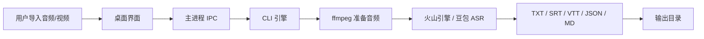

# Desktop Architecture

听稿是 desktop-first，CLI 引擎保留用于自动化和调试。

## Stack

- Electron shell: macOS / Windows / Linux 桌面壳。
- Renderer: plain HTML/CSS/JS，降低依赖和贡献门槛。
- Main process: 文件选择、配置保存、进程编排、日志脱敏。
- CLI engine: `bin/tinggao.mjs` 负责 ffmpeg 音频准备、ASR 调用和文件导出。

## Why Electron first

Tauri 更轻，长期值得考虑。第一版用 Electron 是为了复用 Node CLI，快速做出能跑、能打包、能给 GitHub 用户试用的桌面版。

## Data flow

## Secrets

桌面版凭证保存在 Electron userData 目录，不写入项目仓库。日志展示前会做基础脱敏。

## Release targets

- macOS: DMG / ZIP
- Windows: NSIS installer / portable EXE
- Linux: AppImage / DEB
