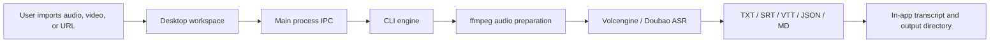

# Desktop Architecture

ScribeStudio is desktop-first, with the CLI engine kept as the automation and debugging layer.

## Stack

- Electron shell: macOS / Windows / Linux desktop app.
- Renderer: plain HTML/CSS/JS to keep the contribution path simple.
- Main process: file selection, config persistence, process orchestration, and log redaction.
- CLI engine: `bin/scribestudio.mjs` handles ffmpeg audio preparation, ASR calls, and file exports.

## Why Electron First

Tauri may be worth exploring later. The first version uses Electron because it can reuse the Node CLI quickly and package a working cross-platform desktop app.

## Data Flow

## Secrets

The desktop app stores credentials in the Electron user data directory and never writes them to the repository. Logs are redacted before being shown in the renderer.

When migrating from the early `tinggao` / `听稿` builds, ScribeStudio attempts to read the legacy config and saves it into the new app config path.

## Release Targets

- macOS: DMG / ZIP
- Windows: NSIS installer / portable EXE
- Linux: AppImage / DEB
